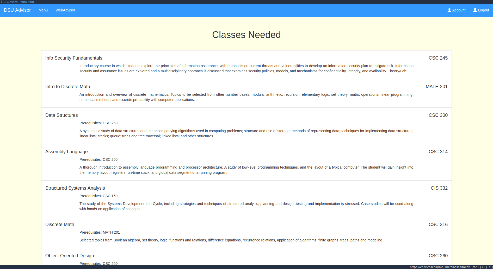
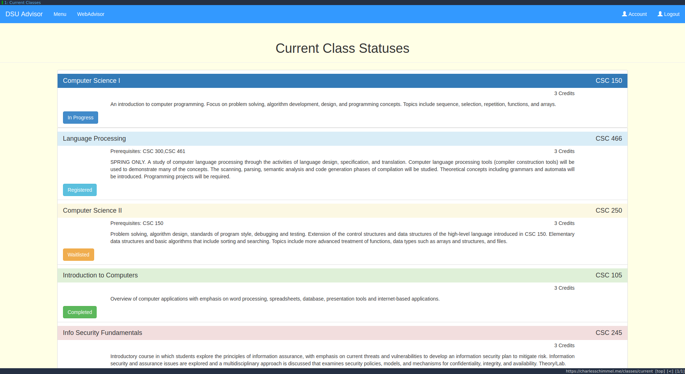
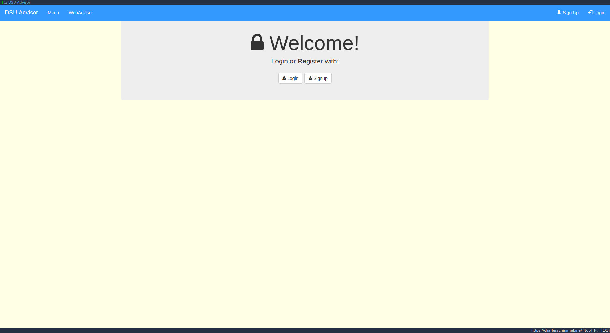
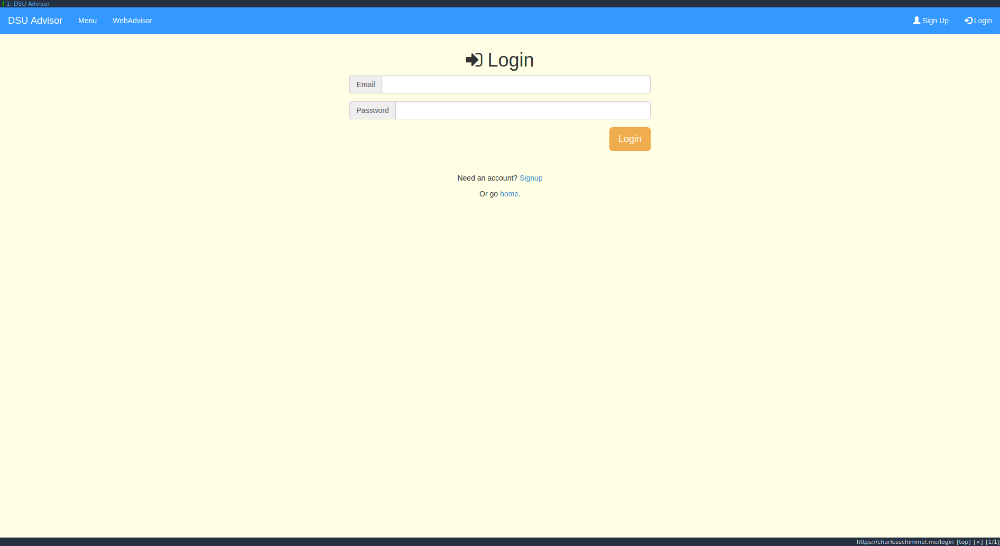
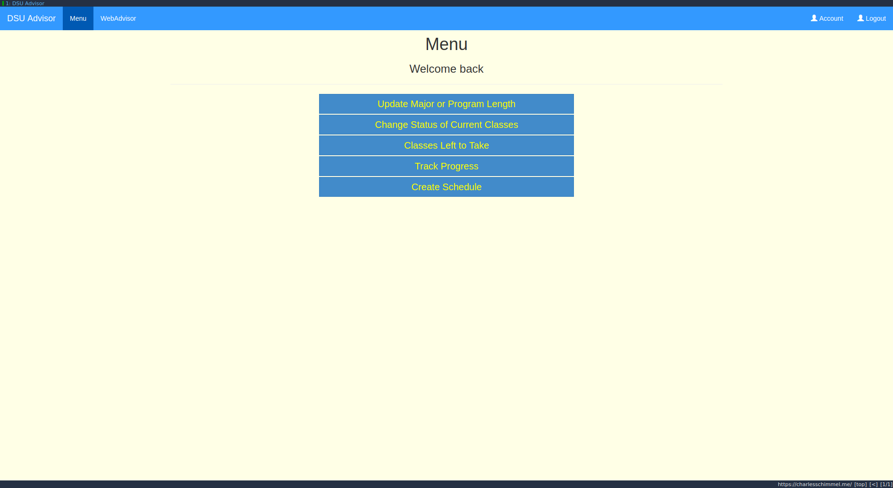
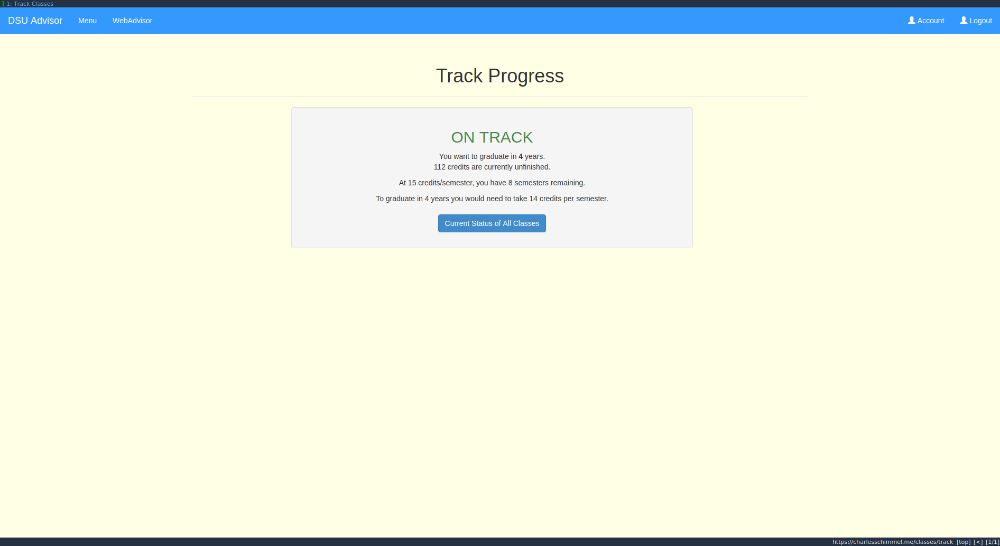
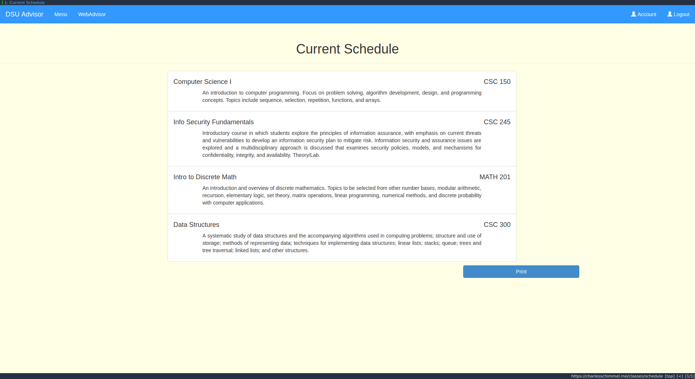
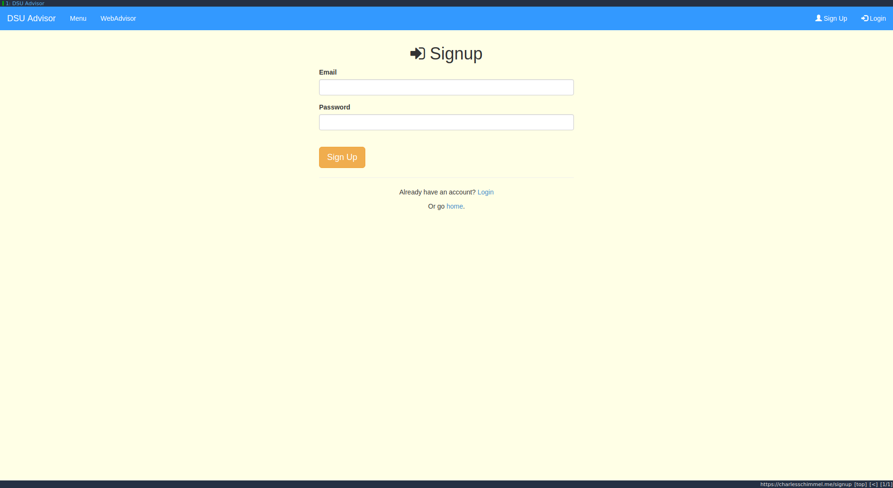

#DSU Advisor

For my Software Engineering course, fall term 2017, I worked with a group to enhance and compliment Dakota State University's "WebAdvisor" application. As any DSU student will tell you, the application can be a bit cumbersome and hard to track the status of all your classes; what you've taken, registered, waitlisted, etc.

The majority of the course focused on the process of developing an application in a mock-business environment. Tasks included database schemas, business proposals, cost-benefit analysis, technology and implementation decisions, and more. The course was focused on a waterfall development strategy. We were given aproximately 2 weeks of implementation time. Given the short implementation time (that needed to be balanced with other course demands) we focused the application on the B.S. Computer Science curriculum.

Some of my contributions include: class and database schema, hosting, backend routing and logic, and front-end state-reactive design. This was the first time I had worked with NodeJS, ExpressJS, and really JavaScript at all in a holistic project. It was a fun and challenging experience and my group was great to work with. Everyone had a different focus in the overall project and we all found a good place to put our talents.

## Screenshots

